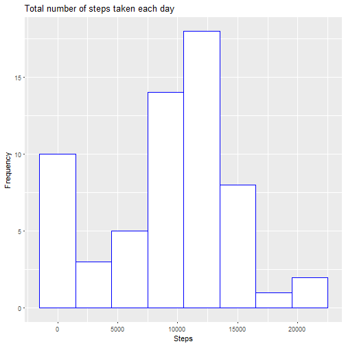

# Reproducible Research: Course Project 1  
  
  
Load required libraries at the first place.

```r
library(dplyr)
library(ggplot2)
library(lubridate)
```
  
  
### Loading and preprocessing the data
Just usual read of CSV file.

```r
activity <- read.csv("activity.csv", header = TRUE)
```
  
  
### What is mean total number of steps taken per day?
At first we calculate total number of steps taken each day.  

```r
total_steps_per_day <- activity %>% group_by(date) %>% summarise(steps_total = sum(steps, na.rm = TRUE))
```

Then create histogram of the total number of steps taken each day.

```r
ggplot(data = total_steps_per_day, aes(steps_total)) + 
    geom_histogram(fill = "white", color = "blue", binwidth = 3000) + 
    labs(title = "Total number of steps taken each day", x = "Steps", y = "Frequency")
```


  
From total number of steps taken each day we calculate mean and median.

```r
mean(total_steps_per_day$steps_total, na.rm = TRUE)
```

```
## [1] 9354.23
```

```r
median(total_steps_per_day$steps_total, na.rm = TRUE)
```

```
## [1] 10395
```
  
  
### What is the average daily activity pattern?
At first we calculate total number of steps taken in each interval.

```r
average_steps_per_interval <- activity %>% group_by(interval) %>% summarise(steps_average = mean(steps, na.rm = TRUE))
```
  
Then create time series plot of average steps taken.

```r
ggplot(data = average_steps_per_interval, aes(interval, steps_average)) + 
    geom_line(color = "blue") +
    labs(title = "Average number of steps taken in each interval", x = "Interval", y = "Steps")
```


  
   
In the calculated step averages per interval, we find the interval containing max.steps number.

```r
average_steps_per_interval %>% filter(steps_average == max(steps_average)) %>% select(interval)
```

```
## # A tibble: 1 × 1
##   interval
##      <int>
## 1      835
```
  
  
### Imputing missing values
Total number of missing values in the dataset.

```r
sum(is.na(activity$steps))
```

```
## [1] 2304
```

Impute missing (NA) values into a new dataset (activity_imputed).  
Imputation is based on mean of given 5-minute interval (which was calculated in previous step into variable "average_steps_per_interval"). 

```r
activity_imputed <- activity

for(i in 1:nrow(activity_imputed)) {
    if (is.na(activity_imputed[i,"steps"])) {
        activity_imputed[i,"steps"] = average_steps_per_interval[average_steps_per_interval$interval == activity_imputed[i,"interval"],"steps_average"]
    }
}
```

Calculation of total number of steps taken each day for the new dataset.  

```r
total_steps_per_day_imputed <- activity_imputed %>% group_by(date) %>% summarise(steps_total = sum(steps))
```

Histogram of the total number of steps taken each day for the new dataset.

```r
ggplot(data = total_steps_per_day_imputed, aes(steps_total)) + 
    geom_histogram(fill = "white", color = "blue", binwidth = 3000) + 
    labs(title = "Total number of steps taken each day (after data imputation)", x = "Steps", y = "Frequency")
```


  
Mean and median of total number of steps taken each day for the new dataset.

```r
mean(total_steps_per_day_imputed$steps_total)
```

```
## [1] 10766.19
```

```r
median(total_steps_per_day_imputed$steps_total)
```

```
## [1] 10766.19
```
As we can see, mean and median of total steps number after data imputation are bigger than before data imputation.

### Are there differences in activity patterns between weekdays and weekends?

At first we create new factor variable (indicating whether a given date is a weekday or weekend) and add it into activity_imputed dataset.

```r
week_part <- as.factor(ifelse(wday(as.Date(activity_imputed$date)) %in% c(1,7), "weekend", "weekday"))
activity_imputed <- cbind(activity_imputed, week_part)
```

Then we calculate total number of steps taken in each interval, separately for weekdays and weekends.

```r
average_steps_per_interval_week_part <- activity_imputed %>% group_by(week_part, interval) %>% summarise(steps_average = mean(steps))
```
  
And create time series plot of average steps taken (averaged across all weekday days or weekend days).

```r
ggplot(data = average_steps_per_interval_week_part, aes(interval, steps_average)) + 
    geom_line(color = "blue") +
    facet_grid(week_part ~ .) +
    labs(title = "Average number of steps taken in each interval \n(averaged across all weekday days or weekend days)", x = "Interval", y = "Steps")
```


